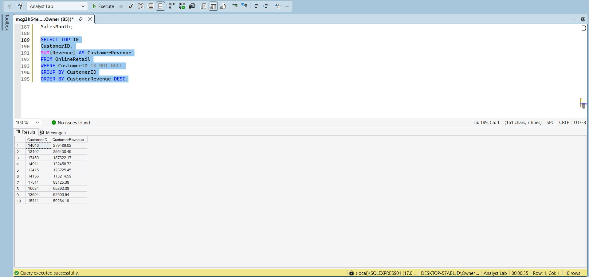

# 🛒 Online Retail Sales Analysis with SQL

An end-to-end SQL project involving data cleaning, feature engineering, statistical analysis, and exploratory data analysis (EDA) on a real-world online retail transactions dataset.

---

# 📌 Project Overview

This project demonstrates a complete SQL data analytics workflow using an online retail transactions dataset containing over **541,000 records**. The project focuses on preparing raw transactional data for analysis through data cleaning and validation before generating actionable business insights using SQL.

The workflow includes duplicate removal, missing value handling, feature engineering, descriptive statistics, and exploratory data analysis to better understand customer behavior, product performance, and sales trends.

---

# 🎯 Project Objectives

* Assess dataset quality.
* Handle missing values.
* Remove duplicate records.
* Validate transactional data.
* Create calculated business metrics.
* Perform statistical analysis.
* Conduct exploratory data analysis.
* Generate actionable business insights.

---

# 📂 Dataset Information

| Item               | Details                    |
| ------------------ | -------------------------- |
| Dataset            | Online Retail Transactions |
| Total Records      | 541,909                    |
| Database           | SQL Server                 |
| Language           | SQL                        |
| Primary Identifier | InvoiceNo                  |

The dataset contains transactional sales records including invoices, products, customers, quantities, prices, and countries.

---

# 🛠 Tools & Technologies

* Microsoft SQL Server
* SQL Server Management Studio (SSMS)

---

# 💡 SQL Skills Demonstrated

* Data Cleaning
* Data Validation
* Duplicate Removal
* Feature Engineering
* Aggregate Functions
* Common Table Expressions (CTEs)
* Window Functions (`ROW_NUMBER()`)
* UPDATE Statements
* DELETE Statements
* GROUP BY
* ORDER BY
* COUNT()
* SUM()
* DISTINCT
* Business Analysis

---

# Data Cleaning Process

The dataset underwent multiple cleaning and validation stages to improve analytical quality.

## ✔ Dataset Familiarization

The dataset was first explored to understand its structure, record count, and available fields.

📷 **Dataset Preview**

## ✔ Missing Values Assessment

Missing values were identified in:

Description
CustomerID

Business evaluation determined that missing CustomerID values should be retained because they still represented valid sales transactions.

---

## ✔ Duplicate Detection & Removal

Duplicate transactional records were identified using a Common Table Expression (CTE) with the `ROW_NUMBER()` window function.

A total of **9,696 duplicate records** were removed.

📷 **Duplicate Detection View**

📷 **Duplicate Removal View**

---

## ✔ Text Standardization

Text fields were standardized by removing leading and trailing spaces from:

* Description
* Country

Country values were also validated for consistency.

---

## ✔ Data Validation

Business validation included:

* Retaining negative quantities as legitimate product returns.
* Removing records with zero unit prices.
* Confirming the absence of negative unit prices.

📷 **Data Validation View**

---

## ✔ Feature Engineering

A new **Revenue** column was created and populated using:

Revenue = Quantity × UnitPrice

This enabled revenue-based analysis throughout the project.

📷 **New Revenue Column View**

📷 **New Revenue Column Verification View**

---

# 📊 Statistical Analysis

Summary statistics were generated after cleaning the dataset.

| Metric          | Value         |
| --------------- | ------------- |
| Total Revenue   | £9,748,131.07 |
| Total Orders    | 534,131       |
| Total Customers | 4,371         |

### Key Observation

The dataset represents substantial commercial activity, generating approximately **£9.75 million** in revenue across more than half a million transactions.

---

# 📈 Exploratory Data Analysis (EDA)

The cleaned dataset was analyzed to uncover key business trends.

## 1. Top Selling Products

Products were ranked based on total quantity sold.

📷 **Top Selling Products View**

---

## 2. Highest Revenue Products

Revenue analysis showed that the products generating the most revenue were not always those with the highest sales volume.

📷 **Highest Revenue Products View**

---

## 3. Monthly Sales Trend

Revenue increased steadily throughout 2011, peaking in **November**, suggesting strong seasonal demand.

📷 **Monthly Sales Trend View**

---

## 4. Customer Spending Analysis

A relatively small group of customers generated a disproportionately large share of total revenue.

📷 **Customer Spending Analysis View**

---

## 5. Highest Revenue Countries

Revenue analysis showed that United kingdom is the country with the highest revenue generated, followed by Netherlands. The country with thw least revenue is sweden.

📷 **Highest Revenue Country View**

---

# 🔍 Key Business Insights

* The business generated approximately **£9.75 million** in revenue.
* Over **530,000 retail transactions** were processed during the reporting period.
* Duplicate records were successfully identified and removed using SQL window functions.
* Product returns were retained to preserve business accuracy.
* Revenue leaders differed from volume leaders, highlighting the importance of product pricing.
* Sales peaked during **November 2011**, indicating strong holiday-season demand.
* A relatively small number of customers contributed a significant share of total revenue, emphasizing the value of customer retention.

---

# 🚀 Key Takeaways

This project demonstrates practical SQL techniques used in real-world retail analytics, including data cleaning, duplicate removal, feature engineering, statistical analysis, and exploratory data analysis to generate meaningful business insights from transactional sales data.

---

## 👤 Author

**I Victor Chimbuo**

Data Analyst | SQL | Power BI | Excel

If you found this project useful, feel free to ⭐ the repository or connect with me on LinkedIn.
